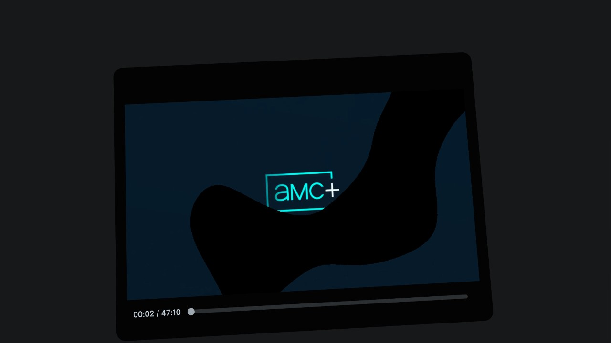
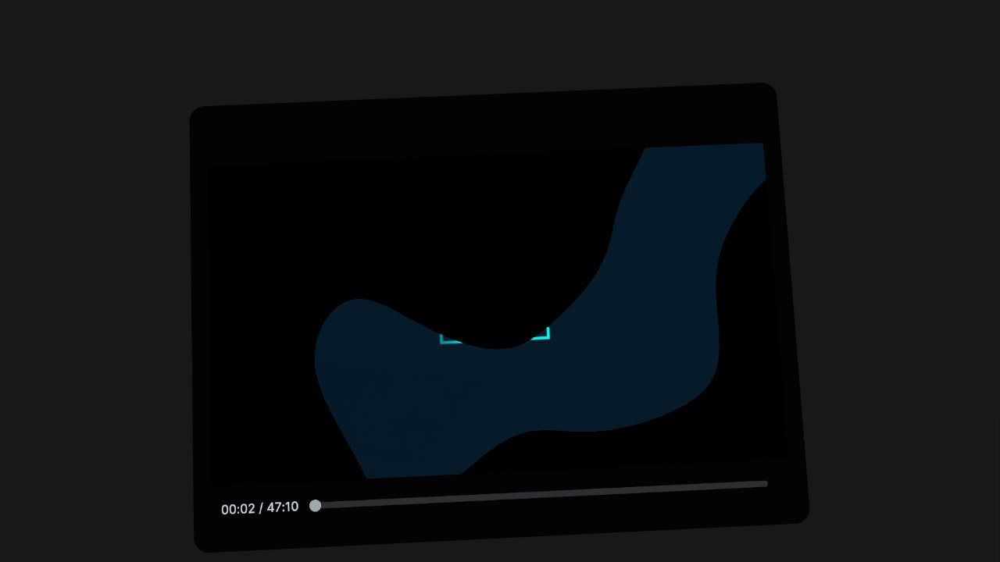
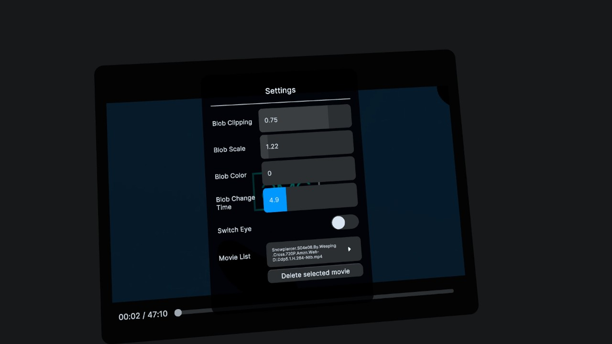

# AmblyoBye

**AmblyoBye** is a virtual reality (VR) application developed using Unity 6000.0.35f1, designed to assist in the treatment of amblyopia (commonly known as "lazy eye") through dichoptic movie viewing.  
Leveraging the capabilities of the Meta Quest 3 VR headset, AmblyoBye offers an engaging and passive therapeutic experience aimed at improving visual acuity in individuals with amblyopia.

---

## 🎯 Purpose

AmblyoBye is inspired by research indicating that dichoptic movie viewing can enhance visual function in amblyopic patients, even beyond the critical period of visual development.  
Studies have shown that presenting different images to each eye can promote binocular vision and reduce suppression of the amblyopic eye ([source](https://pubmed.ncbi.nlm.nih.gov/31558900/)).

## 🛠️ Features

- **Dichoptic Movie Playback**: Presents separate images to each eye to stimulate binocular vision.
- **User-Friendly Interface**: Simple controls for selecting and playing therapeutic movies.
- **Customizable Settings**: Adjust visual parameters to suit individual therapy needs.
- **Progress Tracking**: Monitor viewing time and session history.

---

## 📷 Screenshots

|       **Left Eye View**        |        **Right Eye View**        |
| :----------------------------: | :------------------------------: |
|  |  |

**Settings Screen**  

---

## 🎮 Controls

### VR Controller (Meta Quest 3)

- **Left or Right Thumbstick Press (click)**  
  ➤ Toggles the **Settings Panel** on or off. Use this to show or hide the control sliders during movie playback.

- **Right Trigger Drag and Drop while on the movie panel**  
  ➤ Use this to move the movie screen farther or closer to the eyes

- **Right Trigger Click on movie panel**  
  ➤ Use this to pause/start the movie

- **Right Trigger Drag and Drop on video progress slider**  
  ➤ Use this to go ahead/behind of the movie timeframe
---

### 🧩 In-App Settings Panel

When the settings panel is visible (via thumbstick press), you can adjust the following:

- **✂️ Blob Clipping (Slider)**  
  ➤ Adjusts how sharp or soft the edges of the blob mask appear.

- **🔘 Blob Scale (Slider)**  
  ➤ Adjusts the size of the blob-shaped contrast mask used in the vision therapy.

- **🌫️ Blob Color (Slider)**  
  ➤ Sets how dark or light the background appears in the suppressed eye.

- **⏱️ Blob Change Time (Slider)**  
  ➤ Controls how often the blob mask changes position (in seconds). More frequent changes may stimulate visual processing more effectively.

- **👁️ Switch Eye (Toggle)**  
  ➤ Switch between filtering the left or the right eye. This determines which eye sees the suppressed (dimmed) version of the image.

- **🎞️ Movie Selector (Dropdown List)**  
  ➤ Choose which movie to watch from your loaded videos.

- **🗑️ Delete Movie (Button)**  
  ➤ Removes the selected video from your library.

---

## 📁 Installation & Setup

### 1. Initial Launch - Quest3

Open the AmblyoBye application once to allow it to create the necessary directory structure.

### 2. Supported Video Formats - PC

AmblyoBye supports the following video formats(must be compliant with Meta Quest3 video codecs):  
`.asf`, `.avi`, `.dv`, `.m4v`, `.mp4`, `.mov`, `.mpg`, `.mpeg`, `.ogv`, `.vp8`, `.webm`, `.wmv`

### 3. Movie Conversion - PC

On your computer, download movies and use [HandBrake 1.9.0](https://handbrake.fr/) (or similar video converting tools) to convert your movies to a format that can be used by Quest3 and Unity:
- Format: MP4 (H.264 codec)
- Frame Rate: 30 fps
- Audio: AAC
- Preset: Fast 1080p30 (or a quality preset of your choice)

> ⚠️ Note: While various encodings are supported, H.264 has been found to work best.

### 4. Adding Movies - PC

Transfer your converted movies to the following directory on your Quest 3 device: 
 
Quest 3\Internal shared storage\Android\data\com.amblyobye.amblyobye\Movies

### 5. Relaunch Application - Quest3

After adding movies, reopen AmblyoBye.  
Navigate to the "Movie List" category to select and play your movie from the dropdown list.

---

## 📚 Research Background

The development of AmblyoBye is grounded in research exploring the efficacy of dichoptic treatments for amblyopia.  
Notably, a study titled _"Contribution of Short-Time Occlusion of the Amblyopic Eye to a Passive Dichoptic Video Treatment for Amblyopia beyond the Critical Period"_ demonstrated that dichoptic movie viewing could lead to significant improvements in visual acuity for individuals with amblyopia.  
[Read the full study](https://doi.org/10.1155/2019/6208414)

---

## 👁️ Personal Experience

As the developer of AmblyoBye, I also suffer from amblyopia.  
At the age of 27, my vision in the amblyopic eye was as low as 0.05 visual acuity (VA).  
Through a year of intermittent patching combined with regular use of AmblyoBye, I was able to improve my vision to 0.3-0.4 VA — a meaningful and motivating personal achievement that drives this project's continued development.  
This experience has shown me firsthand that visual improvement is still possible well into adulthood with the right tools and persistence.

---

## ⚠️ Disclaimer

AmblyoBye is intended for use under the guidance of a qualified eye care professional.  
It is not a substitute for professional medical advice, diagnosis, or treatment.  
Always seek the advice of your physician or other qualified health provider with any questions you may have regarding a medical condition.

---

## 🧑‍💻 Developer Notes

- **Unity Version**: 6000.0.35f1  
- **VR Platform**: Meta Quest 3  
- **Video Conversion Tool**: HandBrake 1.9.0

> For optimal performance, ensure that your movies are encoded using the H.264 codec at 30 fps with AAC audio.

---

## 🔬 Reference and Research papers used

Sauvan, L., Stolowy, N., Denis, D., Matonti, F., Chavane, F., Hess, R. F., & Reynaud, A. (2019).  
_Contribution of Short-Time Occlusion of the Amblyopic Eye to a Passive Dichoptic Video Treatment for Amblyopia beyond the Critical Period_.  
Neural Plasticity, 2019. [DOI: 10.1155/2019/6208414](https://doi.org/10.1155/2019/6208414)

S. Boniquet-Sanchez, N. Sabater-Cruz (2019).   
_Current Management of Amblyopia with New Technologies for Binocular Treatment_  
[DOI: 10.3390/vision5020031](https://doi.org/10.3390/vision5020031)

C. Lunghi, M. Berchicci, M. Concetta Morrone, F. Di Russo (2015).  
_Short-term monocular deprivation alters early components of visual evoked potentials_
[DOI: 10.1113/JP270950](https://doi.org/10.1113/JP270950)

